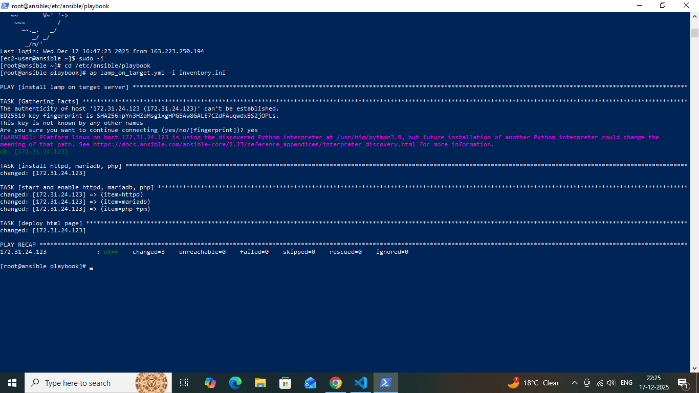
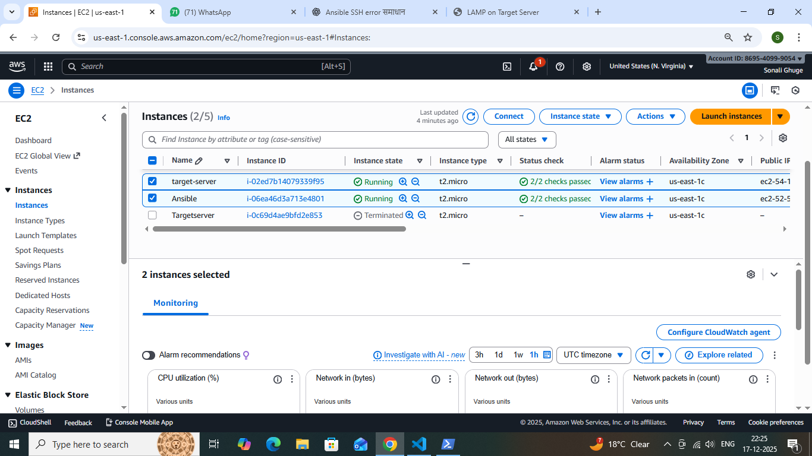

# lamp-deployment-target-server-ansible-inventory--project
### Project Overview

This project demonstrates how to automate the installation of a LAMP stack (Linux, Apache, MariaDB, PHP) on a target server using Ansible.
The playbook installs required packages, starts and enables services, and deploys a custom PHP/HTML web page.

This task was completed as part of a hands-on DevOps/Ansible assignment.

### Technologies Used

- Ansible – Configuration management & automation

- Linux (Amazon Linux / RHEL based) – Target OS

- Apache (httpd) – Web server

- MariaDB – Database server

- PHP – Server-side scripting language

### Project Structure

     ansible/Project Structure
     │── inventory.ini
     │── lamp_on_target.yml
     │── README.md

### Ansible Playbook Description

The Ansible playbook performs the following tasks:

1. Installs Apache, MariaDB, and PHP packages

2. Starts and enables required services

3. Deploys a custom HTML/PHP page to Apache document root   

### Commands Used
### 1️⃣ Run the Ansible Playbook

ansible-playbook lamp_on_target.yml -i inventory.ini

### Output Verification

After successful execution, access the server using the public IP in a browser:

http://<server-public-ip>

### 📸 Screenshots

## Run 

### Ec2 instance

### index.html output

### ✅ Key Learnings

- Understanding Ansible inventory and playbooks

- Automating package installation and service management

- Deploying application content using Ansible

- Troubleshooting SSH and inventory-related issues

### Conclusion

This project helped me gain hands-on experience with Ansible automation and understand how infrastructure tasks can be simplified and standardized using configuration management tools.

